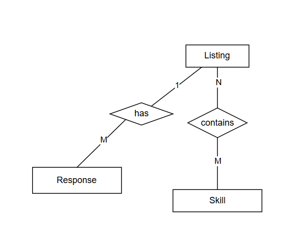

# SKILLSWAP BOARD API

SkillSwap Board is where people can share skills they are willing to teach, ask for skills they want to learn, discover relevant listings, and respond to opportunities posted by others.

## FEATURES

- Create, read, update, and delete listings 
- Link multiple skills to individual listings using many-to-many database relationship
- Submit and view public responses attached to listings
- Filter listings by type or skill, and search descriptions
- Paginate using page and limit query parameters
- Validate incoming request bodies and reject invalid route parameters before database operations.
- Middleware for safe handling of 400, 404 and 500 HTTP responses
- Script to populate PostgreSQL with initial sample data

## FOLDER STRUCTURE

```bash
skillswap-board-api/
|-- package.json
|-- README.md
|-- .env.example
|-- prisma.config.ts
|-- prisma/
|   |-- schema.prisma
|   |-- migrations/
|   -- seed.js
|-- src/
    |-- app.js
    |-- server.js
    |-- lib/
    |   -- prisma.js
    |-- routes/
    |-- controllers/
    |-- services/
    |-- middleware/
```

## API Endpoints

- GET /api/listings
  - Returns public listings with optional filters for type, skill, search, page, and limit query parameters.

- GET /api/listings/:id
  - Finds listing by its ID.

- POST /api/listings
  - Creates a new listing.

- PATCH /api/listings/:id
  - Updates existing listing by its ID.

- DELETE /api/listings/:id
  - Deletes a listing by its ID.

- GET /api/listings/:id/responses
  - Returns all  responses belonging to a specific listing.

- POST /api/listings/:id/responses
  - Creates a new response for a specific listing.

- GET /api/skills
  - Returns all  skills

- GET /api/health
  - Health check
  
## DATABASE DESIGN

### TABLES OVERVIEW
 
1. Listing
   - Stores the type of listing (wanting or offering) and id of user who created it
   - Primary key is id and foriegn key is user_id
2. Skill
   - Stores the name of a skill
   - Primary key is id
3. Response
   - Stores the response text to a listing, the id of the user and id of the listing
   - Primary key is id, foreign keys are listing_id and user_id
4. _ListingToSkill
   - It's an implicit junction table for listing and skill
   - Primary key is (listing_id, skill_id) and foreign keys are listing_id and skill_id
  
### DATABASE RELATIONSHIPS

- One-to-many
  - listing-response : one listing can have multiple reponses but a response belongs to one listing
- Many-to-many
  - listing-skill : a listing may have multiple skills and a skill may belong to multiple listings

### RELATIONSHIP DIAGRAM



## HOW TO RUN

1. Clone the repository  

```bash
git clone https://github.com/Megdelawit365/skillswap-board-api
cd skillswap-board-api
```

2. Install dependencies:

```bash
   npm install
```

3. Create a .env file in the root directory based on .env.example:

```bash
   DATABASE_URL=
   PORT=
```

4. Run database migrations:

```bash
   npx prisma migrate dev
```

5. Seed the database:

```bash
   npx prisma db seed
```

6. Start the server:

```bash
   npm run dev
```
